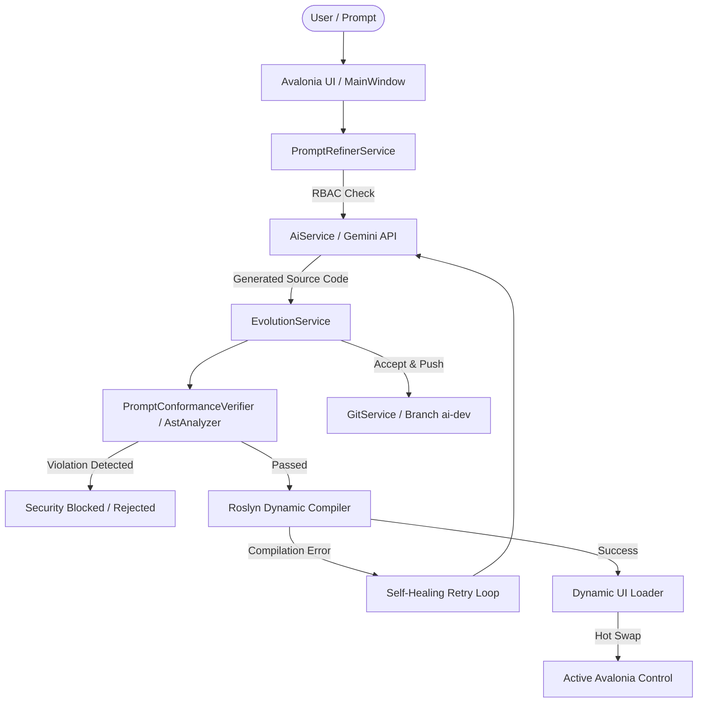

# Kreta - Self-Evolving AI Desktop Architecture

[](https://dotnet.microsoft.com/)
[](https://avaloniaui.net/)
[](https://ai.google.dev/)
[](https://github.com/dotnet/roslyn)
[](LICENSE)

**Kreta** is a self-evolving desktop application built with **Avalonia UI** and **.NET 10.0**. It incorporates an
autonomous AI engine powered by the **Google Gemini API** capable of dynamically generating, compiling, embedding,
updating, and removing C# UI components at runtime based on natural language user prompts.

The system features multi-tiered security guardrails, including **Role-Based Access Control (RBAC)** and **Roslyn
AST-based Static Analysis**, ensuring safety against malicious code injection, process creation, file system tampering,
and unauthorized data access.

---

## Key Features

- **Self-Evolving UI Engine**: Generates C# views dynamically, compiles them on-the-fly using Roslyn, and hot-swaps them
  into the running Avalonia desktop application.
- **Self-Healing Compilation Loop**: Automatic retry mechanism that feeds compilation error logs back to the LLM to fix
  syntax or missing namespace issues autonomously.
- **Roslyn AST Security Guardrails**: Inspects generated Abstract Syntax Trees before execution, blocking dangerous
  operations such as:
    - System file access (`System.IO`) and database file deletion (`File.Delete`).
    - Process creation (`Process.Start`).
    - Outbound network requests (`WebClient`, `HttpClient`).
    - Reflection manipulation (`Type.GetFields`, `MethodInfo.Invoke`).
    - Application termination calls (`Environment.Exit`).
    - Low-level/Unsafe memory manipulation (`unsafe` blocks, `Marshal.Copy`).
- **Role-Based Access Control (RBAC)**: Fine-grained permissions enforced across **Student**, **Teacher**, and
  **Director** roles for `CREATE`, `MODIFY`, and `DELETE` actions.
- **Automated Benchmark Suite**: Integrated 100-test-case CLI suite measuring generation latency, success rates, RBAC
  enforcement, and AST security filter efficacy.
- **Automated Git Integration**: Automatic staging, commit, and push of accepted AI-generated components to dedicated
  repository branches (`ai-dev`).

---

## System Architecture



---

## Project Structure

```
Kreta/
├── App.axaml / App.axaml.cs     # Application entry point & Fluent theme configuration
├── Program.cs                   # Bootstrapper (GUI & --benchmark CLI launcher)
├── MainWindow.axaml             # Main Avalonia window UI (Role selection, prompt bar, tab view)
├── MainWindow.axaml.cs          # Interactive UI logic & state handling
├── Core/                        # Dynamic loader & Core utility abstractions
├── EvolViews/                   # Storage directory for active AI-generated C# views
├── Models/                      # Application domain models & RBAC definitions
├── Services/
│   ├── AI/                      # Gemini API client, Prompt Refiner & AST Verifier
│   │   ├── AiService.cs
│   │   ├── PromptRefinerService.cs
│   │   └── PromptConformanceVerifier.cs
│   ├── Database/                # SQLite DbContext & database seeding logic
│   ├── Evolution/               # Lifecycle orchestration for code generation & self-healing
│   ├── Git/                     # Automated version control integration
│   ├── Security/                # Roslyn AST analyzer & safety rule enforcement
│   └── Testing/                 # 100-test-case automated benchmark engine
└── .env                         # API key & environment configuration
```

---

## Getting Started

### Prerequisites

- [.NET 10.0 SDK](https://dotnet.microsoft.com/download) or later.
- A valid **Google Gemini API Key** ([Get key here](https://aistudio.google.com/)).
- Git installed on your local environment.

### Setup Instructions

1. **Clone the Repository**:
   ```bash
   git clone https://github.com/JLoloCkik/TDK-Main-Project.git
   cd TDK-Main-Project/Kreta
   ```

2. **Configure Environment Variables**:
   Create a `.env` file in the `Kreta/` root directory:
   ```env
   GEMINI_API_KEY=your_gemini_api_key_here
   ```

3. **Build the Project**:
   ```bash
   dotnet build
   ```

4. **Run the Graphical User Interface (GUI)**:
   ```bash
   dotnet run
   ```

---

## Automated Benchmark Suite (CLI Mode)

Kreta includes a built-in CLI benchmark runner that executes 100 standardized test cases covering basic queries, complex
UI generation, modification requests, deletion workflows, and adversarial cybersecurity attacks.

To run the automated benchmark in CLI mode:

```bash
dotnet run -- --benchmark
```

### Benchmark Metrics & Reports

The test runner outputs progress directly to the console and generates an aggregated Markdown report upon completion:

- **`teszt_adatkeszlet_100.md`**: Detailed table of test results, latency metrics, and status breakdown.
- **`benchmark_checkpoint.json`**: Session state allowing test runs to resume automatically if interrupted.

---

## Security & Defense-in-Depth

Kreta applies a multi-layer defense strategy against unaligned or adversarial AI outputs:

| Layer                            | Mechanism                    | Scope                                                       |
|:---------------------------------|:-----------------------------|:------------------------------------------------------------|
| **Layer 1: Prompt Refinement**   | Role-based context injection | Restricts output structure & expected actions               |
| **Layer 2: RBAC Guardrail**      | Permission validation        | Prevents unauthorized `CREATE`/`MODIFY`/`DELETE` calls      |
| **Layer 3: Roslyn AST Analysis** | Static syntax inspection     | Blocks dangerous namespaces, reflection, and file IO        |
| **Layer 4: Sandboxed Loader**    | Isolated dynamic compilation | Ensures broken code is purged without crashing the host app |

---

## License

This project is released under the [MIT License](LICENSE).